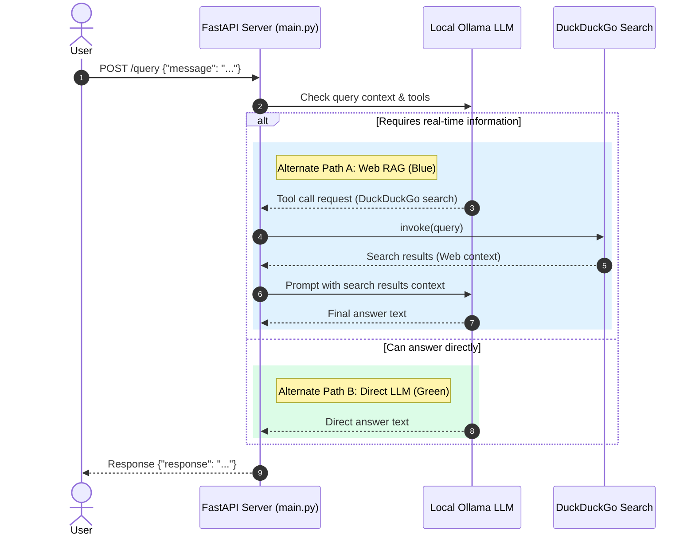

# Ollama Web Search Backend (Local RAG)

A simple, local Retrieval-Augmented Generation (RAG) backend utilizing a local Ollama instance and real-time search context via DuckDuckGo.

## Architecture & Logic Flow

The system operates as a FastAPI web application. When a query is received, the Ollama model is invoked with tool-calling capabilities. It dynamically decides whether the query can be answered directly using its internal weights, or if it needs to pull fresh information from the internet.



## Setup & Running

### 1. Prerequisites
- **Ollama**: Install and run Ollama locally. Ensure the target model (configured in `src/config.py`) is pulled:
  ```bash
  ollama pull llama3  # or whichever model is set in config
  ```

### 2. Environment Setup
Create a `.env` file in the root directory:
```env
OLLAMA_MODEL=llama3
OLLAMA_TEMPERATURE=0.0
HOST=127.0.0.1
PORT=8000
```

### 3. Installation
Set up a Python virtual environment and install dependencies:
```bash
python -m venv venv
source venv/Scripts/activate  # On Windows PowerShell
pip install -r requirements.txt
```

### 4. Running the Server
Run the startup script:
```bash
python src/main.py
```

### 5. Testing
You can run automated unit and end-to-end tests:
```bash
bash run_unit_tests.sh
bash run_e2e_tests.sh
```
