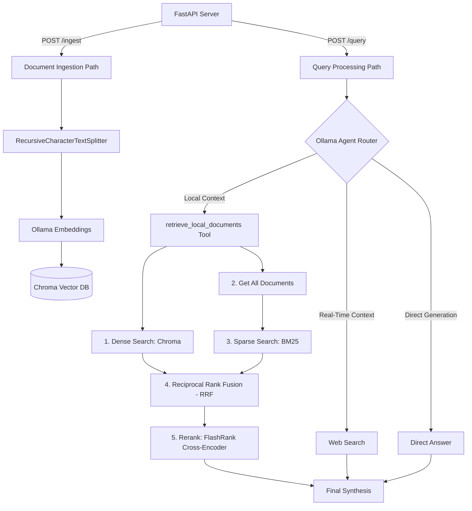
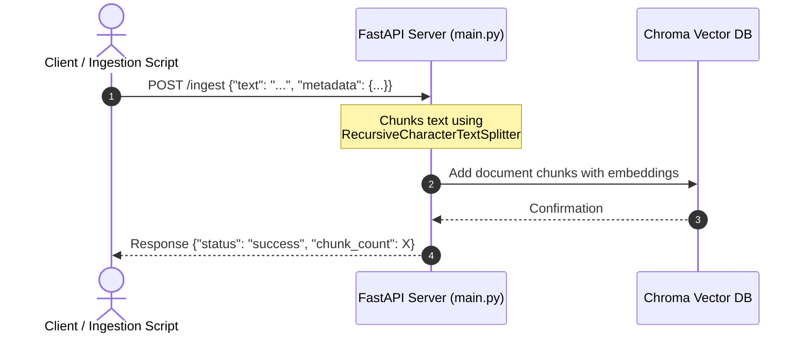
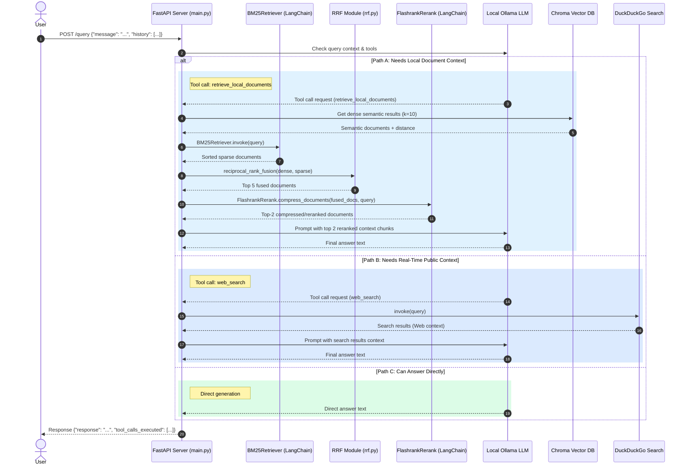

# Ollama Web Search & Vector RAG Backend

A modular, stateless local Retrieval-Augmented Generation (RAG) backend utilizing a local Ollama instance, Chroma Vector Database for local document storage, and DuckDuckGo for public internet search context.

## Features & API Endpoints

The backend exposes two main HTTP POST endpoints under FastAPI:

- **`POST /ingest`**: Accepts raw text documents, splits them into manageable chunks, generates vector embeddings, and stores them in the local Chroma database.
- **`POST /query`**: Accepts user queries and history. An LLM agent determines if the answer requires local document retrieval, a web search, or direct execution.

---

## Architecture & Logic Flow

Below is a high-level flowchart showing how ingestion and querying are routed through the FastAPI backend:

### 1. Ingestion Path

The ingestion pipeline converts plain text into queryable semantic chunks inside the Chroma Vector Database.

### 2. Query Path

When a query is received, the Ollama model is invoked with tool-calling capabilities. It dynamically decides whether it needs to query the local vector database, perform a public web search, or answer directly.

