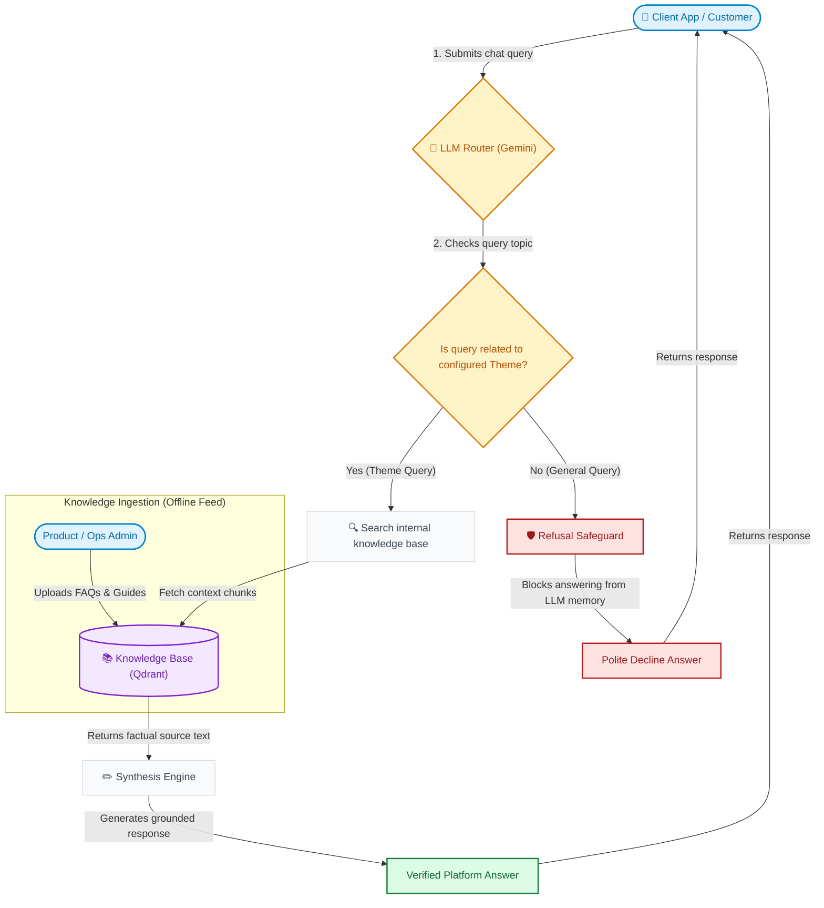
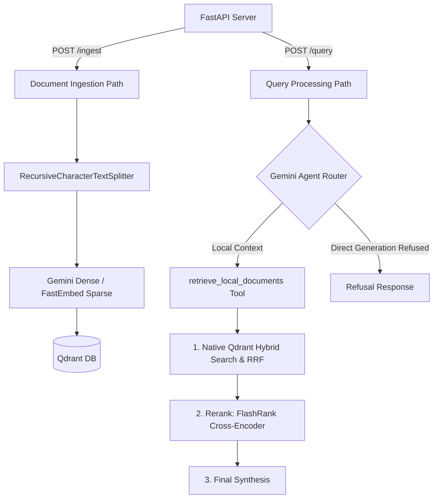
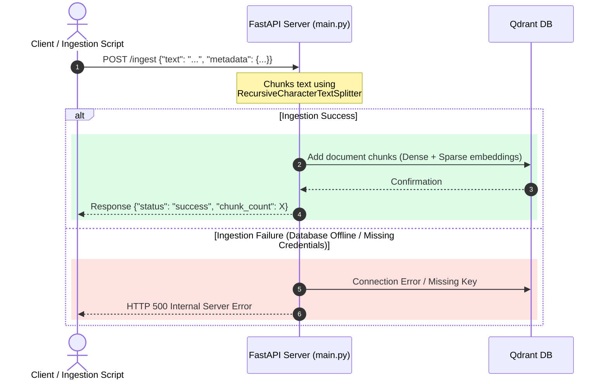
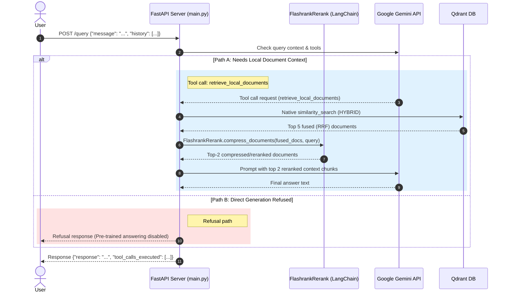

# RAG Chatbot

A modular, stateless Retrieval-Augmented Generation (RAG) customer service chatbot utilizing the Google Gemini API and Qdrant for document storage.

## Business & Product Flow (Overview)

Below is a simplified view of how information flows through the RAG Chatbot system, designed for product managers and operations:



---

## Features & API Endpoints

The backend exposes two main HTTP POST endpoints under FastAPI:

- **`POST /ingest`**: Accepts raw text documents, splits them into manageable chunks (using `RecursiveCharacterTextSplitter`), generates dense/sparse embeddings, and stores them in the Qdrant database.
- **`POST /query`**: Accepts user queries and conversation history. An LLM agent routes queries to retrieve platform documentation from Qdrant. If the query does not match the configured theme, direct generation is refused to keep responses strictly grounded.
- **`GET /health`**: Performs liveness checks, confirming connection to the vector store downstream.

---

## Configuration

The application is configured using environment variables (stored locally in a `.env` file).

| Environment Variable | Description | Default Value |
| :--- | :--- | :--- |
| `GEMINI_API_KEY` | Google Gemini API credentials | *(Required)* |
| `GEMINI_MODEL` | Gemini LLM model for routing and synthesis | `gemini-3.1-flash-lite` |
| `GEMINI_EMBED_MODEL` | Google Generative AI embeddings model | `gemini-embedding-001` |
| `GEMINI_TEMPERATURE` | Generation temperature (0.0 for deterministic RAG answers) | `0.0` |
| `PORT` | FastAPI server port for Chatbot Backend | `8000` |
| `HOST` | FastAPI server bind address | `0.0.0.0` |
| `QDRANT_URL` | URL to access the Qdrant database instance (e.g. `http://localhost:6333` or `:memory:`) | *(Required)* |
| `QDRANT_API_KEY` | Optional API Key if using Qdrant Cloud | `None` |
| `CHATBOT_THEME` | The primary theme boundary for retrieval routing & safeguards | `Fintech SaaS platform` |

---

## Architecture & Logic Flow

Below is a high-level flowchart showing how ingestion and querying are routed through the FastAPI backend:



### 1. Ingestion Path

The ingestion pipeline splits input text and uploads semantic chunks (with both dense Gemini and sparse BM25 embeddings) to the Qdrant database.



### 2. Query Path

When a query is received, the Gemini model is invoked with tool-calling capabilities. It dynamically decides whether it needs to query the local vector database for platform facts or answer directly.



---

## Local Development Setup

To run the chatbot and api gateway services locally on your machine, follow these steps:

### Prerequisites

- Python 3.10 or higher
- Docker Desktop (required to run Qdrant database locally)

### 1. Environment Setup

Configure your Python environment and dependencies:
```bash
./setup_env.sh
```
Or manually:
```bash
python -m venv venv
source venv/bin/activate  # On Windows: venv\Scripts\activate
pip install -r requirements.txt
```

### 2. Configure Environment Variables

Create a `.env` file in the root directory:
```env
GEMINI_API_KEY=your_gemini_api_key_here
GEMINI_MODEL=gemini-3.1-flash-lite
QDRANT_URL=http://localhost:6333
CHATBOT_THEME=Fintech SaaS platform
```

### 3. Run Qdrant Database

Start a local instance of Qdrant Vector DB:
```bash
docker run -d -p 6333:6333 -p 6334:6334 -v $(pwd)/qdrant_storage:/qdrant/storage qdrant/qdrant:latest
```

### 4. Start Chatbot Backend

Run the backend API (FastAPI) on port 8000:
```bash
# Ensure virtualenv is active
python -m uvicorn src.chatbot_backend.main:app --host 0.0.0.0 --port 8000 --reload
```

### 5. Start API Gateway

Run the gateway API (FastAPI proxy) on port 8080:
```bash
# Ensure virtualenv is active
python -m uvicorn src.api_gateway.main:app --host 0.0.0.0 --port 8080 --reload
```